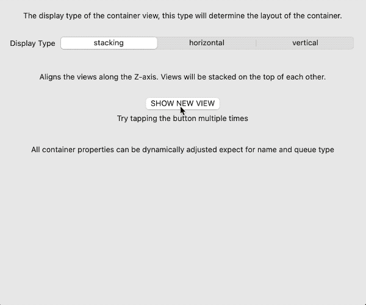
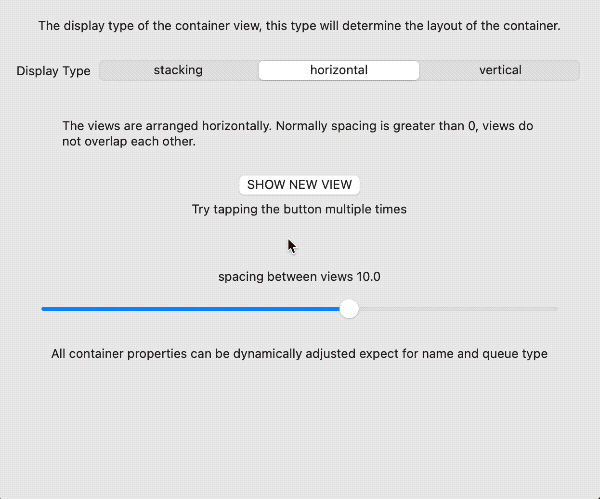
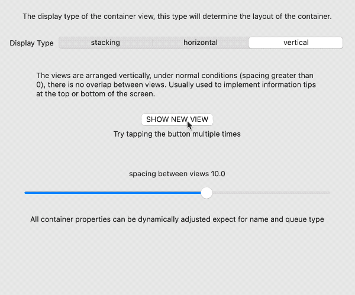
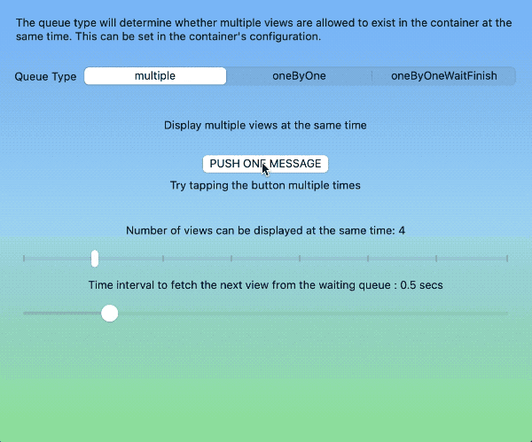
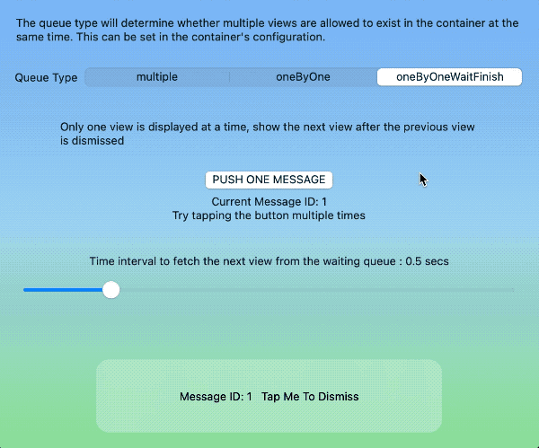
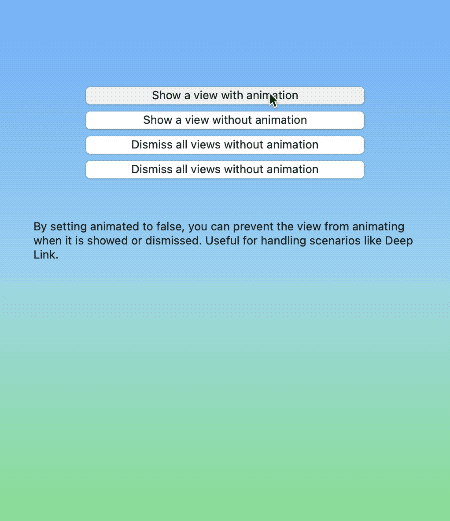

# SwiftUI Overlay Container 2

A highly customizable view container components for SwiftUI

 

[中文版说明](READMECN.md)

Table of Contents
=================

* [SwiftUI Overlay Container 2](#swiftui-overlay-container-2)
   * [Overview](#overview)
   * [Motivation](#motivation)
   * [Features](#features)
   * [Quick Guide](#quick-guide)
      * [Create a container](#create-a-container)
      * [Show views in containers](#show-views-in-containers)
      * [Dismiss all views in the specified container](#dismiss-all-views-in-the-specified-container)
   * [Knowledge](#knowledge)
      * [Container](#container)
      * [Display type](#display-type)
      * [Queue Type](#queue-type)
      * [Configuring the container](#configuring-the-container)
      * [The EnvironmentValue of container](#the-environmentvalue-of-container)
      * [Container view](#container-view)
      * [Configuring the container view](#configuring-the-container-view)
      * [Container Manager](#container-manager)
      * [The EnvironmentValue of container manager](#the-environmentvalue-of-container-manager)
      * [Blockable animation](#blockable-animation)
      * [Use outside of SwiftUI views](#use-outside-of-swiftui-views)
   * [System Requirements](#system-requirements)
   * [Installation](#installation)
   * [Copyrights](#copyrights)
   * [Help and Support](#help-and-support)


## Overview

SwiftUI Overlay Container is a view container component for SwiftUI. It is a customizable, efficient and convenient view manager.

With just a simple configuration, SwiftUI Overlay Container can do the basic work of view organization, queue handling, transitions, animations, interactions, display style configuration and so on for you, allowing developers to devote more effort to the implementation of the application view itself.

## Motivation

When we need to display new content in the upper layer of the view (for example: pop-up information, side menu, help tips, etc.), there are many excellent third-party solutions that can help us achieve it separately, but no solution can deal with different at the same time.

In SwiftUI, describing views has become very easy, so we can completely extract the display logic in the above scenarios, create a library that can cover more usage scenarios, and help developers organize the display style and interaction logic of views .

## Features

* Multiple container support
* Supports multiple views within a single container
* Push views to any specified container within or outside of SwiftUI view code
* The configuration of the container can be modified dynamically (except for `queue type` and `clipped`)
* Views inside a container can be arranged in multiple ways
* There are multiple queue types to guide the container on how to display the view

## Quick Guide

> For more details, see the demo in the library and the comments in the source code.

### Create a container

Create a view container on top of the specified view with the same dimensions as the view it is attached to.

```swift
VStack{
    // your view
}
.overlayContainer("containerA", containerConfiguration: AConfiguration())
```

When no view container is required to be attached to a view.

```swift
ViewContainer("containerB", configuration: BConfiguration())
```

### Show views in containers

Display the view `MessageView` in the view container `containerA`

```swift
.containerView(in: "containerA", configuration: ViewConfiguration(), isPresented: $show, content: MessageView())
```

Use the container manager

```swift
struct ContentView1: View {
    @Environment(\.overlayContainerManager) var manager
    var body: some View {
        VStack {
            Button("push view in containerB") {
                manager.show(view: MessageView(), in: "containerB", using: ViewConfiguration())
            }
        }
    }
}
```

### Dismiss all views in the specified container

```swift
struct ContentView1: View {
    @Environment(\.overlayContainerManager) var manager
    var body: some View {
        VStack {
            Button("push view in containerB") {
                manager.dismissAllView(in: ["containerA","containerB"], animated: true)
            }
        }
    }
}
```

## Knowledge

### Container

The component that receives and displays the view. At least for the container you need to set: name, view display type, view queue type.

You can set the default view style for the container, and for style properties not specified by the view, the container's default settings will be used instead.

### Display type

* stacking

  When multiple views are displayed in the container at the same time, the views are arranged along the Z axis. It behaves like `ZStack`.

  

* horizontal

  When multiple views are displayed in the container at the same time, the views are arranged along the X axis. It behaves like `HStack`.

  

* vertical

  When multiple views are displayed in the container at the same time, the views are arranged along the Y axis. It behaves like `VStack`.

  

### Queue Type

* multiple

  Multiple views can be displayed within a container at the same time. When the given number of views exceeds the maximum number of views set by the container, the excess views will be temporarily stored in the waiting queue, and will be replenished one by one after the displayed views are dismissed.

  

* oneByOne

  Only one view can be displayed in the container at the same time. The newly added view will automatically replace the one being displayed.

  

* oneByOneWaitFinish

  One view can be displayed in the container at the same time. Only after the currently displayed view is dismissed, the new view can be displayed.

  

### Configuring the container

The configuration of the container must set at least the following properties:

```swift
struct MyContainerConfiguration:ContainerConfigurationProtocol{
    var displayType: ContainerViewDisplayType = .stacking
    var queueType: ContainerViewQueueType = .multiple
}
```

Other properties:

* delayForShowingNext

  Time interval to replenish the next view

* maximumNumberOfViewsInMultipleMode

  The maximum number of views that can be displayed simultaneously in the container in multiple mode

* spacing

  Spacing between views in vertical and horizontal modes

* insets

  In stacking mode, the value is an insets value of the view. In horizontal and vertical mode, the value is an insets value of the view group

* clipped

  Clip the container, set to true when you want to limit the bounds of the view transition

* Configuration for all other container views (used as defaults for container views)

  See Configuring Container Views below for details

### The EnvironmentValue of container

Each container provides an environment value - `overlayContainer` for the view inside the container. The view inside the container can obtain the container's information (name, size, display type, queue type) through this value and perform the behavior of dismissing itself.

```swift
struct MessageView: View {
    @Environment(\.overlayContainer) var container
    var body: some View {
        RoundedRectangle(cornerRadius: 10)
            .frame(width: 300, height: 10)
            .overlay(
                HStack {
                    Text("container Name:\(container.containerName)")
                    Button("Dismiss me"){
                        container.dismiss()
                    }
                }
            )
    }
}
```

### Container view

All SwiftUI views can be displayed inside a container. You can create the same view configuration for similar functional views, or make a specific view conform to the `ContainerViewConfigurationProtocol` protocol and set it separately.

### Configuring the container view

```swift
public protocol ContainerViewConfigurationProtocol {
    var alignment: Alignment? { get }
    var tapToDismiss: Bool? { get }
    var backgroundStyle: ContainerBackgroundStyle? { get }
    var backgroundTransitionStyle: ContainerBackgroundTransitionStyle { get }
    var shadowStyle: ContainerViewShadowStyle? { get }
    var dismissGesture: ContainerViewDismissGesture? { get }
    var transition: AnyTransition? { get }
    var autoDismiss: ContainerViewAutoDismiss? { get }
    var disappearAction: (() -> Void)? { get }
    var appearAction: (() -> Void)? { get }
    var animation: Animation? { get }
}
```

* alignment

  Sets the alignment of the view or view group within the container. In stacking mode, you can set a different alignment for each view, and in vertical or horizontal mode, all views (view groups) share the container's alignment settings.

* tapToDismiss

  Whether to allow the view to be dismissed by clicking on the background if the backgroundStyle is set for the view.

  *See the project demo code for details*

* backgroundStyle

  Set the background for the container view. Currently supports color, blur, customView.

  Some versions of operating systems (iOS 14, watchOS) do not support blur mode. If you want to use blur in these versions, you can wrap other blur codes through customView.

  *See the project demo code for details*
  
  

* backgroundTransitionStyle

  background transitions. Default is opacity, set to identity to cancel the transition.

* shadowStyle

  Add shadow to view

* dismissGesture

  Add a cancel gesture to the view, currently supports single tap, double tap, long press, swipe left, swipe right, swipe up, swipe down, and custom gesture.

  Use `eraseToAnyGestureForDismiss` to erase the type when using custom gestures.

  ```swift
  let gesture = LongPressGesture(minimumDuration: 1, maximumDistance: 5).eraseToAnyGestureForDismiss()
  ```

  Under tvOS, only long press are supported

  *See the project demo code for details*
  
  

* transition

  Transition of view

* animation

  The animation of the view transitions

* autoDismiss

  Whether to support automatic dismissing. `.seconds(3)` means that the view will be automatically dismissed after 3 seconds.

  *See the project demo code for details*

* disappearAction

  Closure that executes after the view is dismissed

* appearAction

  Closure that executes before the view is displayed in the container

### Container Manager

The container manager is the bridge between the program code and the container. By calling specific methods of the container manager, the user allows the specified container to perform tasks such as displaying a view, dismissing a view, etc.

### The EnvironmentValue of container manager

In SwiftUI, the view code calls the container manager through the environment value.

```swift
struct ContentView1: View {
    @Environment(\.overlayContainerManager) var manager
    var body: some View {
        VStack {
            Button("push view in containerB") {
                manager.show(view: MessageView(), in: "containerB", using: ViewConfiguration())
            }
        }
    }
}
```

The methods currently provided by the Container Manager are.

* show(view: Content, with ID: UUID?, in container: String, using configuration: ContainerViewConfigurationProtocol, animated: Bool) -> UUID?

  Show the view in the specified container, the return value is the ID of the view

* dismiss(view id: UUID, in container: String, animated flag: Bool)

  Dismiss the view with the specified ID In the specified container,

* dismissAllView(notInclude excludeContainers: [String], onlyShowing: Bool, animated flag: Bool)

  Dismisses views in all containers except the specified container. When `onlyShow` is true, only the view that is being displayed is dismissed.

* dismissAllView(in containers: [String], onlyShowing: Bool, animated flag: Bool)

  Dismiss all views in the specified containers
  
* dismissTopmostView(in containers: [String], animated flag: Bool)

  Dismiss the top view in specified containers

### Blockable animation

The transition animation can be forced to cancel when `animated` is set to false, either by calling the container manager directly or by using a View modifier.

This is useful when dealing with scenarios such as Deep Link.



### Use outside of SwiftUI views

If you want to call the container manager outside of a SwiftUI view, you can call the ContainerManager singleton directly:

```swift
let manager = ContainerManager.share
manager.show(view: MessageView(), in: "containerB", using: ViewConfiguration())
```

## System Requirements

* iOS 14+
* macOS 11+
* tvOS 14+
* watchOS 7+

## Installation

The preferred way to install SwiftUIOverlayContainer is through the Swift Package Manager.

```swift
dependencies: [
  .package(url: "https://github.com/fatbobman/SwiftUIOverlayContainer.git", from: "2.0.0")
]
```

## Copyrights

This library is released under the MIT license. See [LICENSE](LICENSE) for details.

## Help and Support

You can give your feedback or suggestions by creating Issues. You can also contact me on Twitter **[@fatbobman](https://twitter.com/fatbobman)**.
